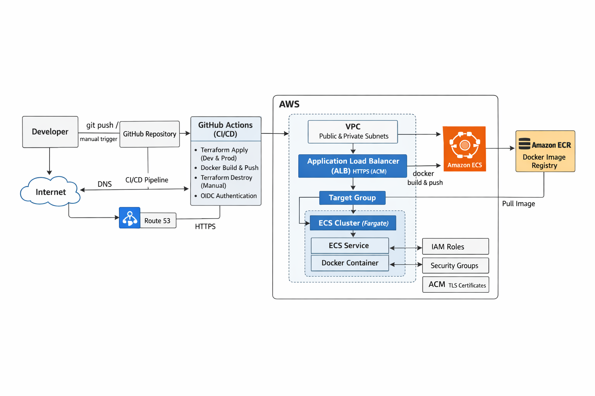
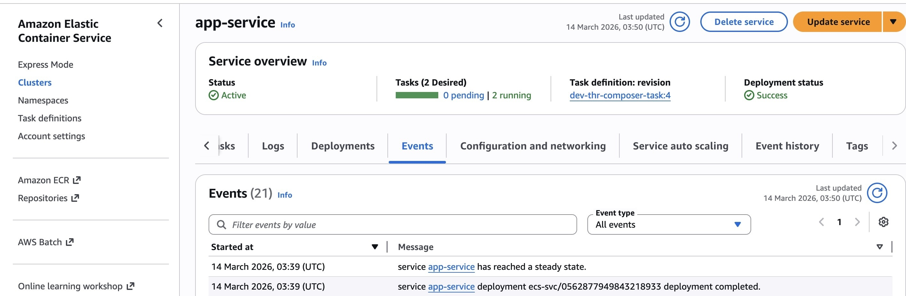
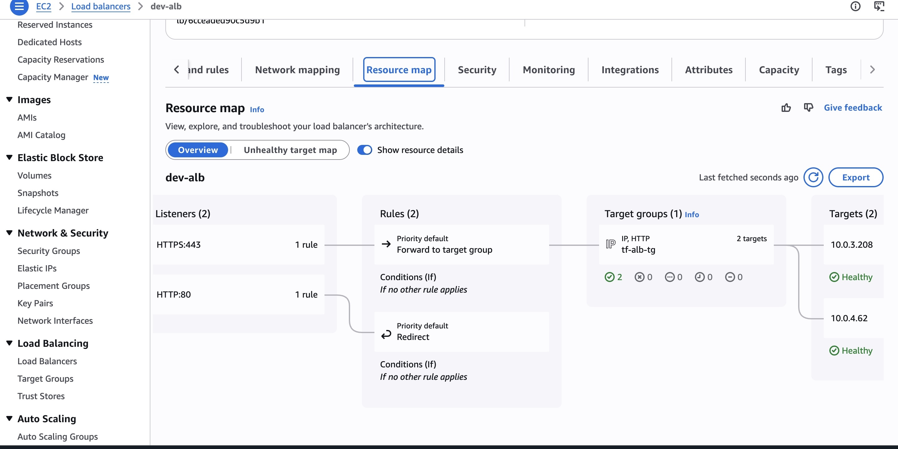
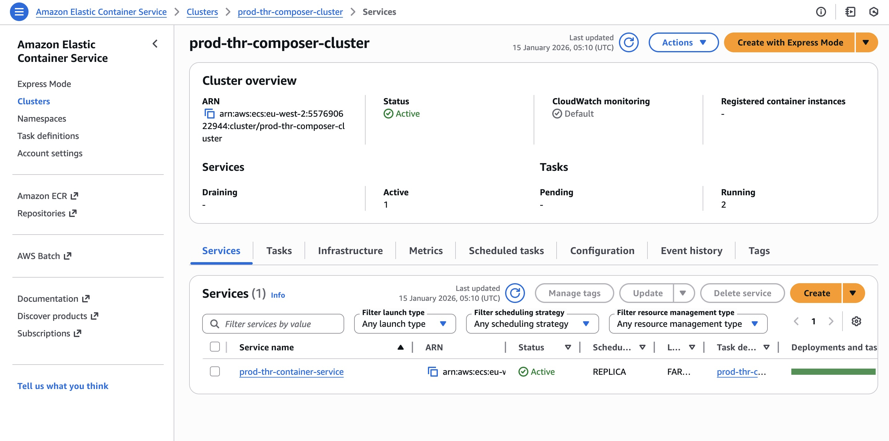
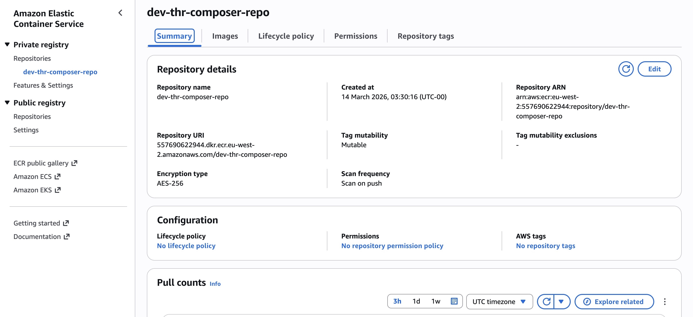
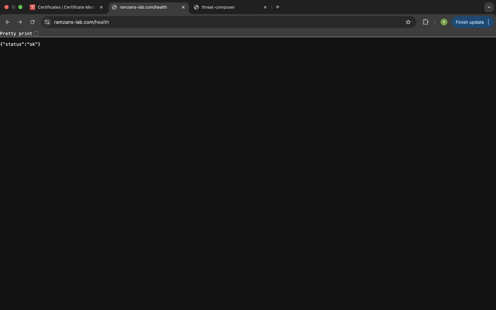
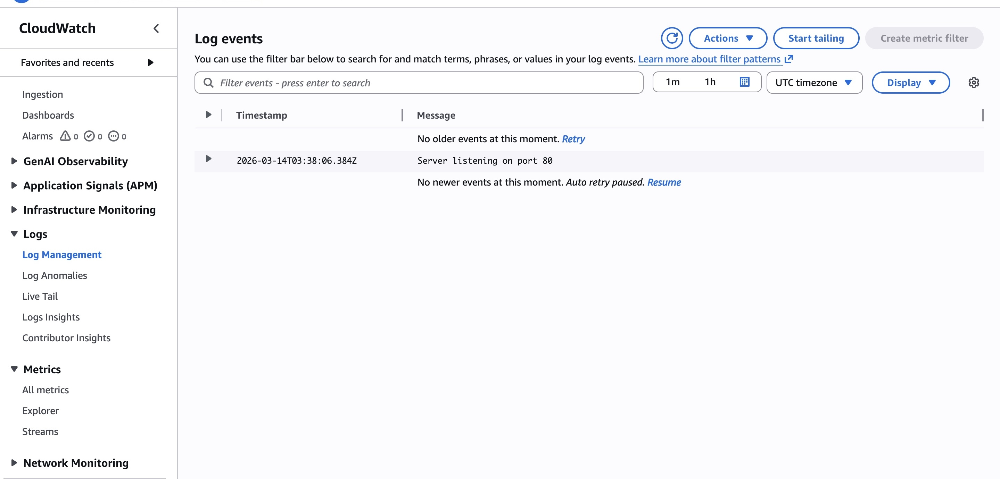
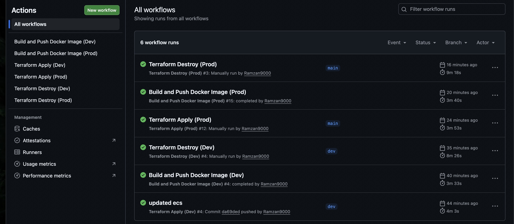

# Threat Composer AWS Deployment Platform


```
Production-style AWS infrastructure platform for deploying a containerized Node.js application using Terraform, ECS Fargate, Docker, and GitHub Actions CI/CD.
```

## Table of Contents

- [Project Overview](#project-overview)
- [Tech Stack](#tech-stack)
- [Key Features](#key-features)
- [Engineering Impact & Problem Being Solved](#engineering-impact--problem-being-solved)
- [Architecture Design Decisions](#architecture-design-decisions)
- [Architecture](#architecture)
- [Infrastructure Validation](#infrastructure-validation)
- [High-Level Architecture & Traffic Flow](#high-level-architecture--traffic-flow)
- [Folder Structure](#folder-structure)
- [Infrastructure Design](#infrastructure-design)
- [Infrastructure](#infrastructure)
- [Application](#application)
- [Deployment](#deployment)
- [Running Locally](#running-locally)
- [Help](#help)
- [Notes](#notes)
- [Author](#author)
- [Version History](#version-history)
- [Acknowledgments](#acknowledgments)

## Project Overview

This project demonstrates a production-style AWS deployment platform for a containerized application using Terraform, Docker, ECS Fargate, and GitHub Actions.

The application is deployed behind an Application Load Balancer inside a custom VPC, with container images stored in Amazon ECR and infrastructure managed through modular Terraform code. DNS is managed with Route 53, and HTTPS is enabled using AWS Certificate Manager (ACM).

The project includes separate Terraform environments for development and production, a dedicated DNS stack for long-lived hosted zone resources, and CI/CD workflows that automate both infrastructure provisioning and container image deployment.

A placeholder container strategy is also used during the initial infrastructure deployment so ECS and the load balancer can be provisioned before the real application image exists in ECR.


### Tech Stack

- **Cloud:** AWS (ECS Fargate, ALB, ECR, Route53, ACM, VPC)
- **Infrastructure as Code:** Terraform
- **Containers:** Docker
- **CI/CD:** GitHub Actions
- **Application:** Node.js


### Key Features

- Containerized application deployment using Docker
- AWS ECS Fargate for serverless container execution
- Application Load Balancer with health checks and target groups
- Amazon ECR for container image storage
- Route 53 for DNS management
- ACM for TLS certificate provisioning and HTTPS support
- Modular Terraform architecture with reusable parent modules and submodules
- Separate Terraform environments for dev, prod, and shared DNS
- Remote Terraform state stored in S3 with DynamoDB state locking
- GitHub Actions CI/CD for Terraform apply/destroy and Docker image delivery
- Placeholder container logic to support infrastructure-first deployments before the real image exists


## Engineering Impact & Problem Being Solved

This project simulates the responsibilities of a cloud engineer designing and maintaining infrastructure for a containerized application platform running in AWS.

### Problem Being Solved

Manual infrastructure provisioning and application deployments can be slow, inconsistent, and difficult to reproduce across environments. Infrastructure changes performed manually can lead to configuration drift, deployment errors, and unreliable environments.

This project demonstrates how **Infrastructure as Code and CI/CD automation** can be used to build a repeatable and reliable platform for deploying containerized applications in AWS.

### Engineering Impact

- **Automated Infrastructure Provisioning**  
  Implemented Terraform modules to provision AWS infrastructure consistently across environments.

- **Improved Deployment Consistency**  
  Introduced GitHub Actions CI/CD workflows to automate Docker image builds, ECR image publishing, and ECS service updates.

- **Environment Isolation**  
  Designed separate Terraform environments (`dev`, `prod`, and `dns`) to allow safe testing and independent lifecycle management.

- **Reliable Infrastructure State Management**  
  Implemented remote Terraform state using Amazon S3 with DynamoDB locking to prevent state conflicts during infrastructure changes.

- **Infrastructure-First Deployment Strategy**  
  Implemented a placeholder container pattern so ECS services and networking infrastructure can be provisioned before the real application image exists.


## Architecture Design Decisions

Several design decisions were made to reflect patterns commonly used in production cloud environments.

- **Modular Terraform Architecture**  
  Infrastructure is organized into reusable Terraform modules, with submodules used for complex services such as ECS, ALB, and VPC networking.

- **Environment-Based Infrastructure**  
  Separate Terraform environments (`dev`, `prod`, and `dns`) isolate infrastructure state and allow safe environment-specific deployments.

- **Dedicated DNS Stack**  
  Route53 hosted zone resources are managed in a separate Terraform stack to prevent accidental deletion when destroying application environments.

- **Secure Networking Design**  
  ECS tasks run inside private subnets while the Application Load Balancer handles incoming public traffic from public subnets.

- **Remote Terraform State Management**  
  Infrastructure state is stored in Amazon S3 with DynamoDB locking to support safe infrastructure updates and collaboration.


## Architecture

The diagram below shows the high-level architecture of the platform, including the CI/CD flow, AWS networking, DNS, HTTPS, container image storage, and ECS application deployment.




## Infrastructure Validation

The screenshots below demonstrate the deployed AWS infrastructure and application working end-to-end.

### ECS Service Running


### ALB HTTPS Listener


### Target Group Health


### ECR Repository


### Application Health Check



### CloudWatch logs



## High-Level Architecture & Traffic Flow

- **GitHub Actions (CI/CD)**  
  Automates Terraform infrastructure provisioning and destruction, builds and pushes Docker images to Amazon ECR, and triggers Terraform updates to switch ECS from the placeholder image to the real application image.

- **Route 53**  
  Manages DNS records for the application domain and points traffic to the Application Load Balancer.

- **AWS Certificate Manager (ACM)**  
  Provisions the TLS certificate used by the HTTPS listener on the Application Load Balancer.

- **Application Load Balancer (ALB)**  
  Public-facing load balancer that accepts incoming traffic and forwards requests to ECS tasks through a target group.

- **ECS Fargate**  
  Runs the containerized `threat-composer` application in private subnets without managing EC2 instances.

- **Amazon ECR**  
  Stores Docker images built in the CI/CD pipeline and used by ECS task definitions.

- **VPC Networking**  
  Includes public and private subnets across two Availability Zones, with an Internet Gateway and NAT Gateway for secure inbound and outbound connectivity.

- **Terraform Remote State**  
  Stores environment state in S3 with DynamoDB locking, while the dev and prod environments read DNS outputs from a dedicated DNS stack using `terraform_remote_state`.

## Folder Structure

```bash

.github/
└── workflows/
    ├── docker-ci-dev.yml
    ├── docker-ci-prod.yml
    ├── terraform-ci-dev.yml
    └── terraform-ci-prod.yml

app/
├── backend/
│   ├── lib/
│   │   └── index.js
│   ├── package-lock.json
│   └── package.json
└── threat-composer/
    └── [application source code]

docker/
├── .dockerignore
├── docker-compose.yaml
└── Dockerfile

ecs/
└── terraform/
    ├── envs/
    │   ├── dev/
    │   │   ├── backend.tf
    │   │   ├── main.tf
    │   │   ├── outputs.tf
    │   │   ├── provider.tf
    │   │   ├── terraform.tfvars
    │   │   └── variables.tf
    │   │
    │   ├── prod/
    │   │   ├── backend.tf
    │   │   ├── main.tf
    │   │   ├── outputs.tf
    │   │   ├── provider.tf
    │   │   ├── terraform.tfvars
    │   │   └── variables.tf
    │   │
    │   └── dns/
    │       ├── backend.tf
    │       ├── main.tf
    │       ├── outputs.tf
    │       ├── provider.tf
    │       ├── terraform.tfvars
    │       └── variables.tf
    │
    └── modules/
        ├── acm/
        │   ├── main.tf
        │   ├── outputs.tf
        │   └── variables.tf
        │
        ├── alb/
        │   ├── main.tf
        │   ├── variables.tf
        │   ├── outputs.tf
        │   └── submodules/
        │       ├── listener/
        │       │   ├── main.tf
        │       │   ├── variables.tf
        │       │   └── outputs.tf
        │       └── target_group/
        │           ├── locals.tf
        │           ├── main.tf
        │           ├── variables.tf
        │           └── outputs.tf
        │
        ├── ecr/
        │   ├── main.tf
        │   ├── variables.tf
        │   └── outputs.tf
        │
        ├── ecs/
        │   ├── main.tf
        │   ├── variables.tf
        │   ├── outputs.tf
        │   └── submodules/
        │       ├── service/
        │       │   ├── main.tf
        │       │   ├── variables.tf
        │       │   └── outputs.tf
        │       └── task_definition/
        │           ├── locals.tf
        │           ├── main.tf
        │           ├── variables.tf
        │           └── outputs.tf
        │
        ├── iam/
        │   ├── main.tf
        │   ├── variables.tf
        │   └── outputs.tf
        │
        ├── route53/
        │   ├── main.tf
        │   ├── variables.tf
        │   └── outputs.tf
        │
        ├── security_groups/
        │   ├── main.tf
        │   ├── variables.tf
        │   └── outputs.tf
        │
        └── vpc/
            ├── main.tf
            ├── variables.tf
            ├── outputs.tf
            └── submodules/
                ├── internet_gateway/
                │   ├── main.tf
                │   ├── variables.tf
                │   └── outputs.tf
                │
                ├── nat_gateway/
                │   ├── main.tf
                │   ├── variables.tf
                │   └── outputs.tf
                │
                ├── private_subnet/
                │   ├── main.tf
                │   ├── variables.tf
                │   └── outputs.tf
                │
                ├── public_subnet/
                │   ├── main.tf
                │   ├── variables.tf
                │   └── outputs.tf
                │
                └── route_tables/
                    ├── main.tf
                    ├── variables.tf
                    └── outputs.tf

.gitignore
.gitmodules
.env
README.md
screenshots/
```

### Infrastructure Design

The Terraform infrastructure follows a modular architecture where each AWS service is implemented as a reusable module.  

Separate environments (`dev`, `prod`, and `dns`) maintain independent Terraform state files, allowing environments to be deployed, updated, or destroyed without affecting shared infrastructure such as the hosted zone.

Submodules are used within larger modules (such as ECS, ALB, and VPC) to separate responsibilities and improve maintainability.


## Infrastructure

### Terraform Modules

- **VPC**  
  Provisions the networking layer, including public/private subnets across two Availability Zones, route tables, an Internet Gateway, and a NAT Gateway.

- **Security Groups**  
  Controls network access between the ALB, ECS tasks, and other AWS resources.

- **IAM**  
  Creates execution and task roles required for ECS services and container workloads.

- **ECR**  
  Creates the container image repository used by the Docker CI/CD pipeline.

- **ECS**  
  Provisions the ECS cluster, task definition, and service used to run the application on Fargate.

- **ALB**  
  Creates the Application Load Balancer, listener configuration, and target group used to route traffic to ECS tasks.

- **ACM**  
  Provisions the SSL/TLS certificate used by the HTTPS listener on the ALB.

- **Route 53**  
  Creates DNS records for the application domain and points them to the ALB.

- **DNS Stack**  
  Separates the hosted zone into its own Terraform environment so shared DNS infrastructure can persist independently from dev and prod application environments.

All infrastructure is implemented using modular Terraform parent modules and submodules to improve reuse, readability, and environment separation.


## Application

- **Dockerfile / docker-compose.yaml**  
  Builds and runs the Node.js application container.

- **app/threat-composer/**  
  Contains the main Threat Composer application code.

- **app/backend/**  
  Contains backend logic and the Node.js API (`lib/index.js`).

Docker images are built and pushed to Amazon ECR through the CI pipeline and tagged using the Git commit SHA for versioning.


## Deployment

### CI/CD Pipeline

#### CI Workflow (docker-ci-dev.yml / docker-ci-prod.yml)



1. Checks out the repository
2. Builds the Docker image from the application source
3. Scans the container image for vulnerabilities
4. Pushes the image to Amazon ECR

#### CD Workflow (terraform-ci-dev.yml / terraform-ci-prod.yml)

1. Runs Terraform `init`, `plan`, and `apply`
2. Provisions or updates AWS infrastructure
3. Updates the ECS task definition with the latest image
4. Performs rolling deployments using ECS Fargate

#### Optional: Manual Destroy

Manual destroy workflows allow safe teardown of environments when required.


### Manual Terraform Commands

```bash
cd ecs/terraform/envs/dev
terraform init
terraform plan
terraform apply -auto-approve
```

### Running Locally
You can run the Node.js app locally using Docker to test your setup before deploying to AWS:

#### 1. Build the Docker image

```bash
docker build -t threat-composer-local:latest -f docker/Dockerfile .
``` 

#### 2. Run Container

```bash
docker run -d -p 8080:80 threat-composer-local:latest
``` 

#### 3. Test Locally

```bash
curl http://localhost:8080/health
```

#### You should see:

{"status":"UP"}


## Help

* If the Docker port is already in use:

```bash
lsof -i :8080
kill -9 <PID>
```


## Notes

- Terraform state is stored remotely using **Amazon S3 with DynamoDB locking**.
- The Route53 hosted zone is managed in a **dedicated DNS Terraform stack** to prevent accidental deletion when destroying dev or prod environments.
- Dev and Prod environments read hosted zone outputs using `terraform_remote_state`.
- A placeholder container image is used during initial infrastructure provisioning before the real application image exists in ECR.


## Author

**Ramzan**

- GitHub: https://github.com/Ramzan9000
- LinkedIn: https://www.linkedin.com/in/ramzan-k


## Version History

**0.3**
- Added Route53 DNS management
- Added ACM certificate provisioning
- Implemented dedicated DNS Terraform stack
- Added placeholder container deployment logic

**0.2**
- Added ECS service, ALB, IAM roles, and ECR repository

**0.1**
- Initial Terraform infrastructure and Docker setup


## Acknowledgments

* AWS Documentation for ECS, ECR, ALB

* Terraform AWS Provider Docs

* Docker Official Documentation

* Inspiration from containerized application deployment best practices


